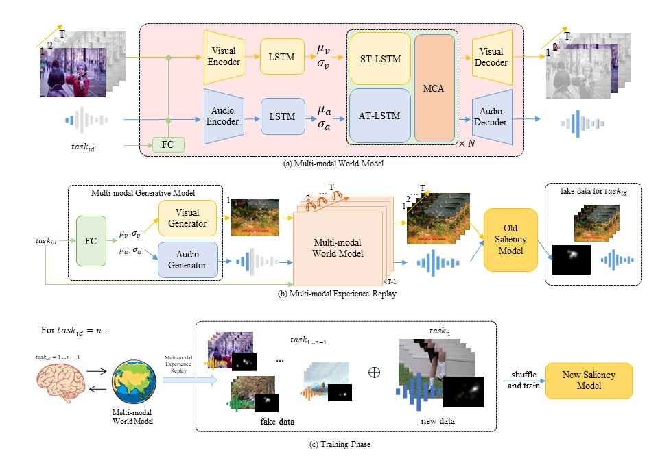

#  CLAVS: A Novel Continual Learning Benchmark and model for Audio-visual Saliency Prediction
Offical implemention of the paper CLAVS: A Novel Continual Learning Benchmark and model for Audio-visual Saliency Prediction
All Code will come soon.

 

 

# 📌 TODOs
- [x] release model files.
- [ ] release train/test files.
- [ ] release pretrained weights.

